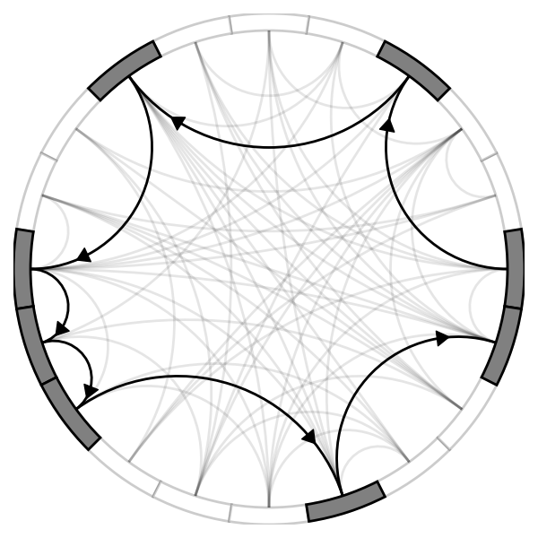

## Interim results
Apply DDQN(Double Deep Q-Learning) to find the longest route on a DAG(Directed Acyclic Graph)

### Result of a DAG with 20 nodes
**The directed acyclic graph is arranged as follows**:
- any node can only reach nodes with larger indices
- the node with the smallest index is positioned on the far right
- the indices increasing in a counterclockwise direction.
